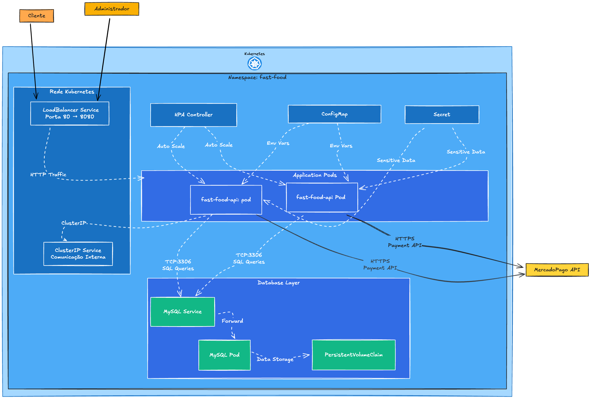
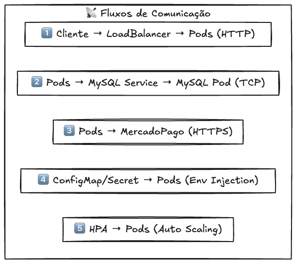

# Tech Challenge - Sistema de Autoatendimento para Lanchonete

Este projeto é parte do **Tech Challenge - Fase 02**, implementando um sistema completo de controle de pedidos para lanchonete com arquitetura Clean Code, Clean Architecture e infraestrutura Kubernetes.

## 📋 Índice

- [Visão Geral](#-visão-geral)
- [Arquitetura do Sistema](#-arquitetura-do-sistema)
- [Tecnologias](#-tecnologias)
- [Estrutura do Projeto](#-estrutura-do-projeto)
- [APIs da Fase 2](#-apis-da-fase-2)
- [Infraestrutura Kubernetes](#-infraestrutura-kubernetes)
- [Configuração](#️-configuração)
- [Execução](#-execução)
- [Documentação da API](#-documentação-da-api)
- [Testes](#-testes)
- [Guia de Execução Completo](#-guia-de-execução-completo)
- [Vídeo Demonstrativo](#-vídeo-demonstrativo)
- [Documentação DDD](#-documentação-do-sistema-ddd-com-event-storming)

## 🎯 Visão Geral

Este projeto implementa um sistema completo de autoatendimento para lanchonetes seguindo os padrões **Clean Code** e **Clean Architecture**, com infraestrutura **Kubernetes** para alta disponibilidade e escalabilidade.

### Funcionalidades Principais:
- **Gestão de Clientes**: Cadastro e consulta de clientes por CPF
- **Catálogo de Produtos**: CRUD completo com categorização (lanches, acompanhamentos, bebidas, sobremesas)
- **Sistema de Pedidos**: Criação, acompanhamento e atualização de status dos pedidos
- **Integração de Pagamento**: Integração com MercadoPago para processamento de pagamentos via QR Code
- **Webhook de Pagamentos**: Recebimento automático de confirmações de pagamento
- **Painel Administrativo**: Monitoramento de pedidos em andamento com ordenação específica

### Fluxo de Negócio:
1. **Recebimento**: Cliente faz pedido → Sistema gera checkout
2. **Pagamento**: QR Code MercadoPago → Confirmação via webhook  
3. **Produção**: Pedido segue fluxo: `Recebido` → `Em Preparação` → `Pronto` → `Finalizado`
4. **Ordenação**: Lista prioriza `Pronto` > `Em Preparação` > `Recebido` + mais antigos primeiro

## 🛠 Tecnologias

### Backend
- **Go 1.23+** - Linguagem de programação
- **Gin** - Framework web HTTP
- **MySQL 8.0** - Banco de dados relacional
- **MercadoPago SDK** - Processamento de pagamentos

### DevOps & Infraestrutura
- **Docker** - Containerização da aplicação
- **Kubernetes** - Orquestração de containers
- **Helm** - Gerenciador de pacotes Kubernetes
- **HPA** - Auto-scaling horizontal de pods
- **ConfigMaps & Secrets** - Gerenciamento de configurações

### Documentação & Testes
- **Swagger** - Documentação interativa da API
- **Go Testing** - Testes unitários
- **Postman Collection** - Exemplos de requisições

### Arquitetura
- **Clean Architecture** - Separação de responsabilidades
- **Hexagonal Architecture** - Ports and Adapters
- **Domain-Driven Design** - Modelagem orientada ao domínio

## 📁 Estrutura do Projeto

O projeto segue o **Clean Architecture** organizando o código em camadas bem definidas:

```
├── cmd/
│   └── server/              # Ponto de entrada da aplicação
│       └── main.go
├── internal/
│   ├── domain/              # Regras de negócio e entidades
│   │   ├── entities/        # Entidades do domínio
│   │   └── ports/           # Interfaces (contratos)
│   │       ├── input/       # Portas de entrada (services)
│   │       │   └── services/
│   │       └── output/      # Portas de saída (repositories)
│   ├── application/         # Casos de uso e serviços
│   │   ├── usecases/        # Implementação dos casos de uso
│   │   └── dto/             # Data Transfer Objects
│   ├── interface/           # Interfaces
│   │   │   ├── controllers/    # Controllers HTTP 
│   │   │   ├── presenters/     # Configuração dos presenters
│   │   │   └── routers/        # Configuração de rotas 
│   └── infrastructure/     # Configurações e conexões externas
│       ├── persistance/    # Implementação dos repositórios e persistencia de dados
│       │   └── gateways/
├── helm/                   # Helm Chart
│   └── fast-food/
│       ├── Chart.yaml
│       ├── values.yaml
│       ├── README.md
│       └── templates/
│           ├── deployment.yaml
│           ├── service.yaml
│           ├── mysql-deployment.yaml
│           ├── mysql-service.yaml
│           ├── configmap.yaml
│           ├── secret.yaml
│           ├── hpa.yaml
│           ├── namespace.yaml
│           ├── serviceaccount.yaml
├── docs/                   # Documentação Swagger
│   ├── docs.go
│   ├── swagger.json
│   └── swagger.yaml
├── Makefile                # Comandos de automação
└── README.md               # Documentação completa
```

## 🏗️ Arquitetura do Sistema

### Diagrama da Infraestrutura Kubernetes
O sistema utiliza **Clean Architecture** com infraestrutura **Kubernetes** gerenciada por **Helm**:





### Como a Aplicação se Comunica com o Banco?
1. **Pods da Aplicação** fazem conexões TCP na porta 3306
2. **MySQL Service** (`fast-food-api-mysql`) roteia para o **MySQL Pod**
3. **Configurações** injetadas via **ConfigMap** (host, porta, database) e **Secret** (senha)
4. **Dados persistidos** no **PVC** (10Gi) para sobreviver a restarts

### Como os Componentes Kubernetes se Comunicam?
1. **LoadBalancer** recebe tráfego externo e distribui para os pods
2. **ClusterIP Services** permitem comunicação interna entre pods
3. **HPA** monitora métricas e escala pods automaticamente
4. **ConfigMaps/Secrets** injetam configurações nos pods via variáveis de ambiente
5. **DNS interno** do cluster resolve nomes de services automaticamente

### Requisitos da Fase 2 Atendidos:
- ✅ **Kubernetes**: Deployment e Service implementados
- ✅ **Helm**: Gerenciamento de pacotes e versionamento
- ✅ **Escalabilidade (HPA)**: Auto-scaling de 2-10 pods
- ✅ **Segurança**: ConfigMaps e Secrets para dados sensíveis
- ✅ **Alta Disponibilidade**: Múltiplos pods e persistência

## 🔗 APIs da Fase 2 - Requisitos Obrigatórios

### 1. **Checkout Pedido** - `POST /api/v1/orders`
- Recebe produtos solicitados e retorna identificação do pedido

### 2. **Consultar Status do pagamento** - `GET /api/v1/orders/{id}`  
- Informa se o pagamento foi aprovado ou não

### 3. **Webhook Pagamento** - `POST /api/v1/payments/webhook`
- Recebe confirmação de pagamento (aprovado/recusado) do MercadoPago

### 4. **Lista Ordenada** - `GET /api/v1/orders/kitchen`
- Retorna pedidos ordenados: **Pronto** > **Em Preparação** > **Recebido**
- Mais antigos primeiro, sem pedidos "Finalizado"

### 5. **Atualizar Status** - `PATCH /api/v1/orders/{id}/status`
- Atualiza status do pedido para controle da cozinha

### 📚 Documentação Completa
- **Swagger**: `http://localhost:8080/swagger/index.html`
- **Collection Postman**: Disponível na pasta `docs/`

## ☸️ Deploy e Execução

### Deploy com Helm (Produção):
```bash
# Deploy completo com Helm
make helm-deploy

# Verificar status  
make helm-status

# Acessar aplicação
make helm-port-forward

# Upgrade do release
make helm-upgrade
```

### Desenvolvimento Local:
```bash
# Execução rápida com Docker
make docker-run

# Acessar aplicação
curl http://localhost:8080/health
```

## ⚙️ Configuração

### Pré-requisitos

- **Docker** - Para execução do projeto
- **Git** - Para clonar o repositório

### Variáveis de Ambiente

Crie um arquivo `.env` na raiz do projeto:

```env
# Banco de Dados
DB_USER=root
DB_PASSWORD=root
DB_HOST=localhost
DB_PORT=3306
DB_NAME=fast_food_db

# MercadoPago
ACCESSTOKEN=seu_token_mercadopago_aqui

# Servidor
PORT=8080
```

### Instalação

1. Clone o repositório:
```bash
git clone https://github.com/samuellalvs/soat_tech_challenge_fast_food.git
cd soat_tech_challenge_fast_food
```

> **Nota**: Não é necessário instalar dependências ou gerar documentação Swagger manualmente. O Docker se encarrega de tudo automaticamente durante o build.

## 🚀 Execução

1. **Construa e inicie os containers**:
```bash
docker compose up --build
```

2. **A aplicação estará disponível em**: `http://localhost:8080`

3. **Para parar os containers**:
```bash
docker compose down
```

### Acesso rápido aos serviços

- **API**: http://localhost:8080
- **Swagger**: http://localhost:8080/swagger/index.html
- **Health Check**: http://localhost:8080/health

## 📚 Documentação da API

### Swagger

A documentação completa da API está disponível através do **Swagger**:

1. **Com a aplicação rodando**, acesse:
   - **URL**: [http://localhost:8080/swagger/index.html](http://localhost:8080/swagger/index.html)

### Endpoints Principais

#### 👤 Clientes
- `POST /api/v1/customers` - Cadastrar novo cliente
- `GET /api/v1/customers/{cpf}` - Buscar cliente pelo CPF

#### 🍔 Produtos
- `POST /api/v1/products` - Criar novo produto
- `GET /api/v1/products` - Listar todos os produtos
- `GET /api/v1/products/category/{category}` - Listar por categoria
- `PUT /api/v1/products` - Atualizar produto
- `DELETE /api/v1/products/{id}` - Remover produto

#### 🧾 Pedidos
- `POST /api/v1/orders` - Criar novo pedido
- `GET /api/v1/orders/{id}` - Buscar pedido por ID
- `PATCH /api/v1/orders/{id}/status` - Atualizar status do pedido

#### 📊 Administração
- `GET /api/v1/orders/kitchen` - Listar pedidos em andamento

### Exemplo de Uso

```bash
# Criar um cliente
curl -X POST http://localhost:8080/api/v1/customers \
  -H "Content-Type: application/json" \
  -d '{"first_name":"João","last_name":"Silva","email":"joao@email.com","cpf":"123.456.789-00"}'

# Criar um produto
curl -X POST http://localhost:8080/api/v1/products \
  -H "Content-Type: application/json" \
  -d '{"name":"Big Burger","description":"Hambúrguer artesanal","price":"25.90","category":"burger"}'

# Criar um pedido
curl -X POST http://localhost:8080/api/v1/orders \
  -H "Content-Type: application/json" \
  -d '{"customer_id":1,"cpf":"123.456.789-00","status":"received","items":[{"product_id":1,"quantity":2,"price":25.90}]}'
```

## 🧪 Testes

### Executar Testes

```bash
# Com Make
make test

# Direto com Docker
docker run --rm -v $(pwd):/app -w /app golang:1.24-alpine go test ./...

# Testes com coverage
go test ./... -v -cover
```

## 📖 Guia de Execução

### 🚀 Início Rápido

#### Preparação:
```bash
git clone https://github.com/samuellalvs/soat_tech_challenge_fast_food.git
cd soat_tech_challenge_fast_food
```

#### Opção 1 - Docker (Desenvolvimento):
```bash
make docker-run
curl http://localhost:8080/health  # Verificar saúde
```

#### Opção 2 - Kubernetes (Produção):
```bash
make helm-deploy                   # Deploy completo
make helm-port-forward            # Acesso local
```

### 🧪 Testando as APIs da Fase 2

```bash
# 1. Checkout de pedido
curl --request POST \
  --url http://localhost:8080/api/v1/orders \
  --data '{
	"customer_id": null,
	"cpf": null,
	"items": [
		{
			"product_id":1,
			"quantity":2
		}
	],
	"payment_method": "qr_code"
}'

# 2. Consultar status
curl --request GET \
  --url http://localhost:8080/api/v1/payments/status/2

# 3. Webhook de pagamento
curl --request POST \
  --url http://localhost:8080/api/v1/payments/webhook \
  --header 'Content-Type: application/json' \
  --data '{
    "order_id": 2,
    "transaction_id": "TXN_DEMO_123456789",
    "status": "approved",
    "amount": 40.30,
    "processed_at": "2025-01-15T10:03:00Z"
}'

# 4. Pedidos ordenados (admin)
curl http://localhost:8080/api/v1/orders/kitchen

# 5. Atualizar status
curl -X PATCH http://localhost:8080/api/v1/orders/1/status \
  -H "Content-Type: application/json" \
  -d '{"status":"preparation"}'
```

### 🔗 URLs de Acesso
- **API**: http://localhost:8080
- **Swagger**: http://localhost:8080/swagger/index.html
- **Health**: http://localhost:8080/health

## 🎥 Vídeo Demonstrativo

📹 **[Link do Vídeo]()**

O vídeo demonstra:
- ✅ Arquitetura Kubernetes funcionando
- ✅ Deploy da aplicação
- ✅ Funcionamento de todos os endpoints
- ✅ HPA em ação com escalabilidade
- ✅ Fluxo completo do negócio
- ✅ Integração com MercadoPago

## 📚 Documentação do sistema (DDD) com Event Storming

As versões da documentação do DDD estão disponíveis através dos links do Miro:

- [**DDD - Versão 1** - Iniciação](https://miro.com/app/board/uXjVIDaCt8I=/)
- [**DDD - Versão 2** - Evolução](https://miro.com/app/board/uXjVI26PK8k=/)
- [**DDD - Versão 3** - Final](https://miro.com/app/board/uXjVIzM5S5Q=/)
